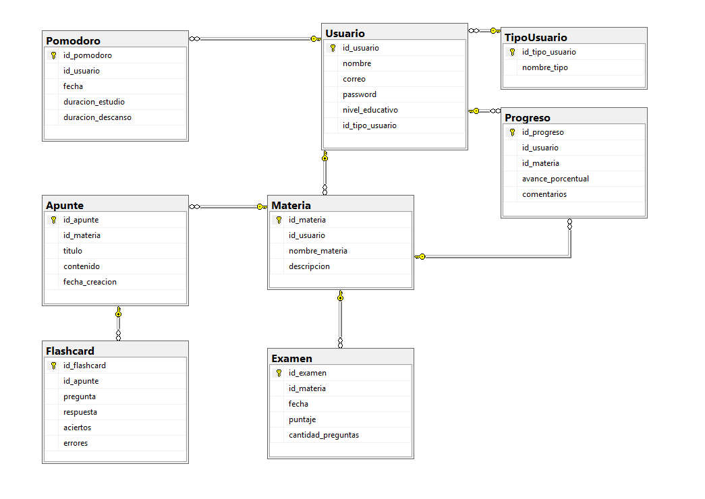
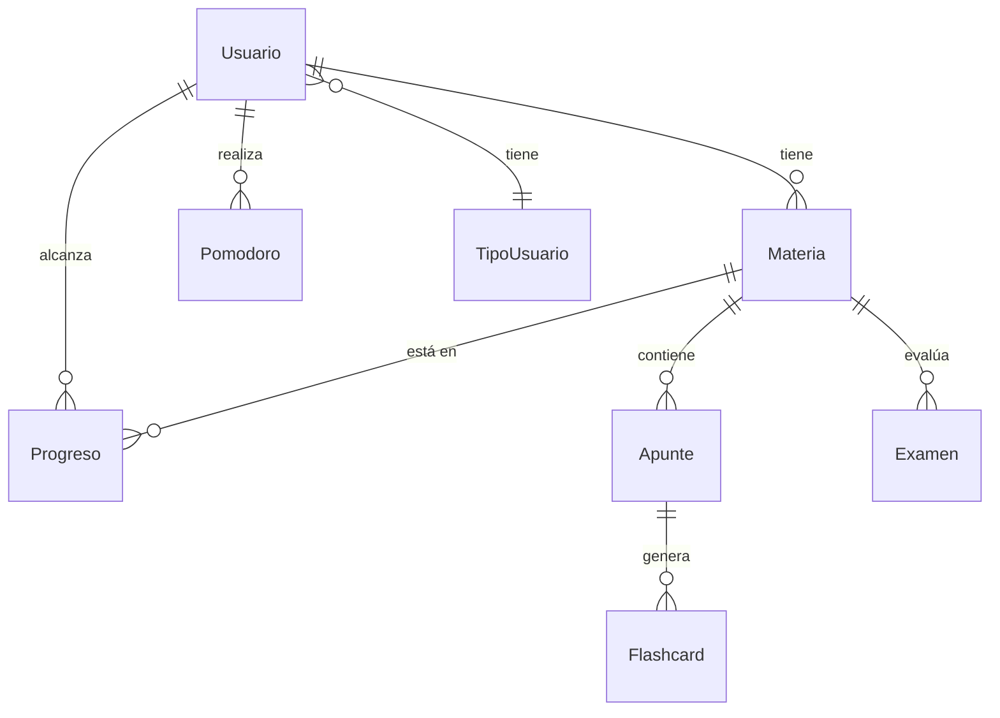

# PROYECTO DE ESTUDIO

# PRESENTACIÓN (Título/Nombre Proyecto)

**Asignatura**: Bases de Datos I (FaCENA-UNNE)

## GRUPO 14

**Integrantes**:
> - Gregorchuk, Meza Lau
> - Merlo, Wilson Julian
> - Rios, Karen Silvina
> - Varela, Franco Martin

### Año de Cursado: 2025

# CAPÍTULO I: INTRODUCCIÓN

## 1.1 INTRODUCCIÓN

El presente proyecto propone el diseño e implementación de un sistema académico integral denominado StudIA. Este sistema busca centralizar múltiples funcionalidades de apoyo al aprendizaje, como la gestión de materias, apuntes digitales, flashcards, simulacros de exámenes, sesiones Pomodoro y seguimiento del progreso académico. De esta forma, se pretende resolver la fragmentación que actualmente sufren los estudiantes al utilizar diversas aplicaciones dispersas, ofreciendo una solución unificada y respaldada por una base de datos relacional sólida y segura.

## 1.2 Definición o planteamiento del problema.

Los estudiantes enfrentan la problemática de que, en caso de querer hacerlo, tener que utilizar diferentes aplicaciones para gestionar sus hábitos de estudio, preparar evaluaciones, crear apuntes y registrar su progreso. Esta dispersión de datos genera pérdida de información, duplicación de esfuerzos y falta de una visión clara de la evolución académica. Por ello, surge la necesidad de diseñar un sistema integral que unifique estas funcionalidades en un entorno organizado y eficiente, con soporte de una base de datos relacional.

## 1.3 Objetivo del Trabajo Práctico.

El objetivo general del proyecto es diseñar e implementar un modelo de datos relacional que sirva de soporte a la aplicación StudIA, garantizando integridad, consistencia y escalabilidad.

### 1.3.1 Objetivo General.

Diseñar e implementar un modelo de datos relacional que respalde el sistema StudIA, asegurando integridad, consistencia y soporte a las principales funcionalidades de la aplicación.

### 1.3.2 Objetivos Específicos.

- Identificar las entidades, atributos y relaciones necesarias del sistema.
- Desarrollar un diagrama entidad-relación (DER) que represente el modelo conceptual.
- Elaborar el diccionario de datos con definición de campos, tipos de datos y restricciones.
- Implementar el script SQL de creación de tablas y restricciones en el DBMS.
- Asegurar la integridad referencial mediante claves primarias y foráneas.

## 1.4 Alcance del trabajo

El alcance de esta primera entrega se limita al diseño y construcción del modelo de base de datos. Se incluyen el diagrama entidad-relación, el diccionario de datos y la definición de restricciones. Quedan fuera de alcance, en esta etapa, la implementación de la interfaz de usuario, la integración de algoritmos de inteligencia artificial y funcionalidades adicionales.

# CAPÍTULO II: MARCO CONCEPTUAL O REFERENCIAL

**TEMA 1 "Procedimientos y funciones almacenadas."** 
> Acceder a la siguiente carpeta para la descripción completa del tema [scripts-> tema_1](script/Tema01_Procedimientos_y_funciones_almacenadas)

**TEMA 2 "Optimización de consultas a través de índices."** 
> Acceder a la siguiente carpeta para la descripción completa del tema [scripts-> tema_2](script/Tema02_Optimizacion_de_consultas_a_traves_de_indices)

**TEMA 3 "Manejo de transacciones y transacciones anidadas."** 
> Acceder a la siguiente carpeta para la descripción completa del tema [scripts-> tema_3](script/Tema03_Manejo_de_transacciones_y_transacciones_anidadas)

**TEMA 4 "Manejo de tipos de datos JSON."** 
> Acceder a la siguiente carpeta para la descripción completa del tema [scripts-> tema_4](script/Tema04_Manejo_de_tipos_de_datos_JSON)

# CAPÍTULO III: METODOLOGÍA SEGUIDA 

 CAPÍTULO III: METODOLOGÍA SEGUIDA

Para la realización del proyecto, se siguió una metodología estructurada en las siguientes fases:

1. Análisis de Requerimientos: Se identificó la problemática central: la fragmentación de herramientas que usan los estudiantes. Se plantearon los objetivos de unificar la gestión de materias, apuntes, flashcards, exámenes y seguimiento de progreso en un solo sistema.

2. Diseño de la Base de Datos: Se crearon los modelos conceptual y relacional de la base de datos. Se definieron las entidades principales (Usuario, Materia, Apunte, Flashcard, Examen, Progreso, Pomodoro y TipoUsuario) y se establecieron sus relaciones mediante claves primarias y foráneas.

3. Diccionario de Datos: Se documentó formalmente cada tabla y sus columnas en un diccionario de datos. Este documento detalla los tipos de datos (ej. correo como varchar(150)), su significado (Contraseña encriptada) y las restricciones aplicadas.

4. Creación e Implementación en SQL Server Se implementó la base de datos en SQL Server, ejecutando el script_ddl_proyecto.sql para crear la estructura de tablas y sus restricciones de integridad referencial. Posteriormente, se realizó una carga inicial de datos (script_insert_proyecto.sql) para poblar la base de datos con un conjunto de usuarios, materias y apuntes representativos para las pruebas funcionales.

5. Investigación y Demostración Técnica: El núcleo del trabajo consistió en la investigación y aplicación práctica de cuatro conceptos avanzados de SQL Server, donde cada integrante desarrolló un informe y un script de prueba:

    Procedimientos y Funciones Almacenadas: Se desarrollaron para encapsular la lógica de negocio, reducir el tráfico de red y crear funciones reutilizables.

    Manejo de Transacciones: Se implementó un escenario (registrar un examen, pomodoro y progreso) bajo una transacción con TRY...CATCH y ROLLBACK para garantizar la atomicidad (el principio de "todo o nada") y mantener la integridad de los datos.

    Manejo de tipos de datos JSON: Se exploró la flexibilidad de almacenar datos semi-estructurados (JSON) en una columna NVARCHAR(MAX), aplicando una CONSTRAINT CHECK (ISJSON(contenido) = 1) y consultando sus datos internos con JSON_VALUE y JSON_QUERY.

    Optimización de Consultas con Índices: Se realizó una prueba de carga masiva (WHILE loop) para insertar 2 millones de registros en la tabla Apunte. Se demostró la diferencia crítica de rendimiento entre un "Clustered Index Scan" (2 millones de filas leídas) y un "Index Seek" (1 fila leída) tras crear un índice no agrupado.
# CAPÍTULO IV: DESARROLLO DEL TEMA / PRESENTACIÓN DE RESULTADOS 
### Diagrama relacional

### Diagrama conceptual 
Ejemplo usando Live Editor https://mermaid.js.org/

### Diccionario de datos

Acceso al documento [PDF](doc/diccionario_datos.pdf) del diccionario de datos. 

### Desarrollo TEMA 1 "Procedimientos y funciones almacenadas"

> Acceder a la siguiente carpeta para la descripción completa del tema [scripts-> tema_1](script/Tema01_Procedimientos_y_funciones_almacenadas)

...

### Desarrollo TEMA 2 "Optimización de consultas a través de índices."
> Acceder a la siguiente carpeta para la descripción completa del tema [scripts-> tema_2](script/Tema02_Optimizacion_de_consultas_a_traves_de_indices)

...

### Desarrollo TEMA 3 "Manejo de transacciones y transacciones anidadas."
> Acceder a la siguiente carpeta para la descripción completa del tema [scripts-> tema_4](script/Tema03_Manejo_de_transacciones_y_transacciones_anidadas)

...

### Desarrollo TEMA 4 "Manejo de tipos de datos JSON."
> Acceder a la siguiente carpeta para la descripción completa del tema [scripts-> tema_4](script/Tema04_Manejo_de_tipos_de_datos_JSON)

...

# CAPÍTULO V: CONCLUSIONES
En conclusión, el proyecto cumplió su objetivo de diseñar el modelo relacional "StudIA". Se creó una base de datos sólida que garantiza la integridad y escalabilidad, resolviendo el problema de la fragmentación de herramientas de estudio.

La investigación técnica demostró que el sistema está optimizado para los cuatro pilares clave de una base de datos moderna:
     1. Rendimiento: Con índices, logrando reducir consultas de 2 millones de filas leídas a solo 1 (Index Scan vs. Index Seek).
     2. Integridad: Con transacciones (ACID), asegurando que operaciones complejas (como registrar un examen) sean de "todo o nada" mediante el uso de ROLLBACK ante errores.
     3. Eficiencia: Con procedimientos almacenados, que encapsulan la lógica (ej. SP_InsertarApunte), reducen el tráfico de red y aumentan la seguridad.
     4. Flexibilidad: Con soporte JSON, permitiendo guardar y consultar (JSON_VALUE) datos semi-estructurados dentro del modelo relacional, combinando lo mejor de ambos mundos.
     
El resultado es una base de datos robusta, escalable y lista para una implementación real.

# BIBLIOGRAFÍA DE CONSULTA
 1. [...](https://learn.microsoft.com/es-es/sql/relational-databases/json/json-data-sql-server?view=sql-server-ver17)
 2. ...
 3. ...
 4. ...
 5. ...

