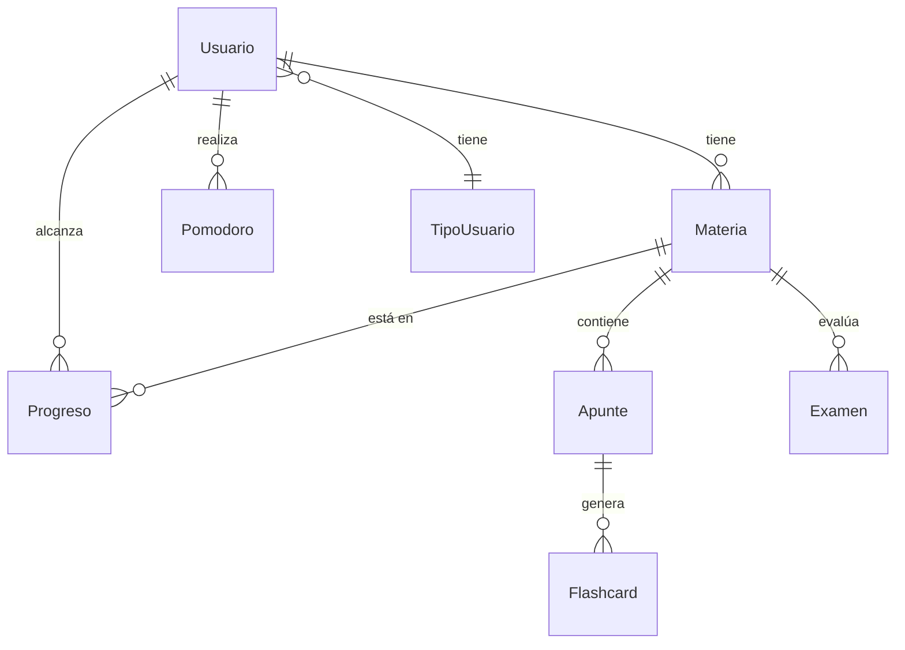

# PROYECTO DE ESTUDIO

# PRESENTACIÓN (Título/Nombre Proyecto)

**Asignatura**: Bases de Datos I (FaCENA-UNNE)

## GRUPO 14

**Integrantes**:
> - Gregorchuk, Meza Lau
> - Merlo, Wilson Julian
> - Rios, Karen Silvina
> - Varela, Franco Martin

### Año de Cursado: 2025

# CAPÍTULO I: INTRODUCCIÓN

## 1.1 INTRODUCCIÓN

El presente proyecto propone el diseño e implementación de un sistema académico integral denominado StudIA. Este sistema busca centralizar múltiples funcionalidades de apoyo al aprendizaje, como la gestión de materias, apuntes digitales, flashcards, simulacros de exámenes, sesiones Pomodoro y seguimiento del progreso académico. De esta forma, se pretende resolver la fragmentación que actualmente sufren los estudiantes al utilizar diversas aplicaciones dispersas, ofreciendo una solución unificada y respaldada por una base de datos relacional sólida y segura.

## 1.2 Definición o planteamiento del problema.

Los estudiantes enfrentan la problemática de que, en caso de querer hacerlo, tener que utilizar diferentes aplicaciones para gestionar sus hábitos de estudio, preparar evaluaciones, crear apuntes y registrar su progreso. Esta dispersión de datos genera pérdida de información, duplicación de esfuerzos y falta de una visión clara de la evolución académica. Por ello, surge la necesidad de diseñar un sistema integral que unifique estas funcionalidades en un entorno organizado y eficiente, con soporte de una base de datos relacional.

## 1.3 Objetivo del Trabajo Práctico.

El objetivo general del proyecto es diseñar e implementar un modelo de datos relacional que sirva de soporte a la aplicación StudIA, garantizando integridad, consistencia y escalabilidad.

### 1.3.1 Objetivo General.

Diseñar e implementar un modelo de datos relacional que respalde el sistema StudIA, asegurando integridad, consistencia y soporte a las principales funcionalidades de la aplicación.

### 1.3.2 Objetivos Específicos.

- Identificar las entidades, atributos y relaciones necesarias del sistema.
- Desarrollar un diagrama entidad-relación (DER) que represente el modelo conceptual.
- Elaborar el diccionario de datos con definición de campos, tipos de datos y restricciones.
- Implementar el script SQL de creación de tablas y restricciones en el DBMS.
- Asegurar la integridad referencial mediante claves primarias y foráneas.

## 1.4 Alcance del trabajo

El alcance de esta primera entrega se limita al diseño y construcción del modelo de base de datos. Se incluyen el diagrama entidad-relación, el diccionario de datos y la definición de restricciones. Quedan fuera de alcance, en esta etapa, la implementación de la interfaz de usuario, la integración de algoritmos de inteligencia artificial y funcionalidades adicionales.

# CAPÍTULO II: MARCO CONCEPTUAL O REFERENCIAL

**TEMA 1 "Procedimientos y funciones almacenadas."** 
...

**TEMA 2 "Optimización de consultas a través de índices."** 
...

**TEMA 3 "Manejo de transacciones y transacciones anidadas."** 
...

**TEMA 4 "Manejo de tipos de datos JSON."** 
...

# CAPÍTULO III: METODOLOGÍA SEGUIDA 

 **a) Cómo se realizó el Trabajo Práctico**
...

 **b) Herramientas (Instrumentos y procedimientos)**
...

# CAPÍTULO IV: DESARROLLO DEL TEMA / PRESENTACIÓN DE RESULTADOS 
### Diagrama relacional

### Diagrama conceptual 
Ejemplo usando Live Editor https://mermaid.js.org/

### Diccionario de datos

Acceso al documento [PDF](doc/diccionario_datos.pdf) del diccionario de datos. 

### Desarrollo TEMA 1 "Procedimientos y funciones almacenadas"

> Acceder a la siguiente carpeta para la descripción completa del tema [scripts-> tema_1](script/Tema01_Procedimientos_y_funciones_almacenadas)

...

### Desarrollo TEMA 2 "Optimización de consultas a través de índices."
> Acceder a la siguiente carpeta para la descripción completa del tema [scripts-> tema_2](script/Tema02_Optimizacion_de_consultas_a_traves_de_indices)

...

### Desarrollo TEMA 3 "Manejo de transacciones y transacciones anidadas."
> Acceder a la siguiente carpeta para la descripción completa del tema [scripts-> tema_4](script/Tema03_Manejo_de_transacciones_y_transacciones_anidadas)

...

### Desarrollo TEMA 4 "Manejo de tipos de datos JSON."
> Acceder a la siguiente carpeta para la descripción completa del tema [scripts-> tema_4](script/Tema04_Manejo_de_tipos_de_datos_JSON)

...

# CAPÍTULO V: CONCLUSIONES
...

# BIBLIOGRAFÍA DE CONSULTA
 1. ...
 2. ...
 3. ...
 4. ...
 5. ...

